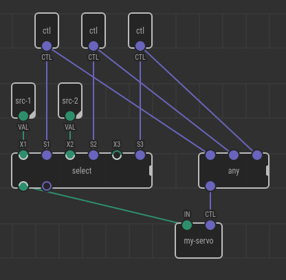
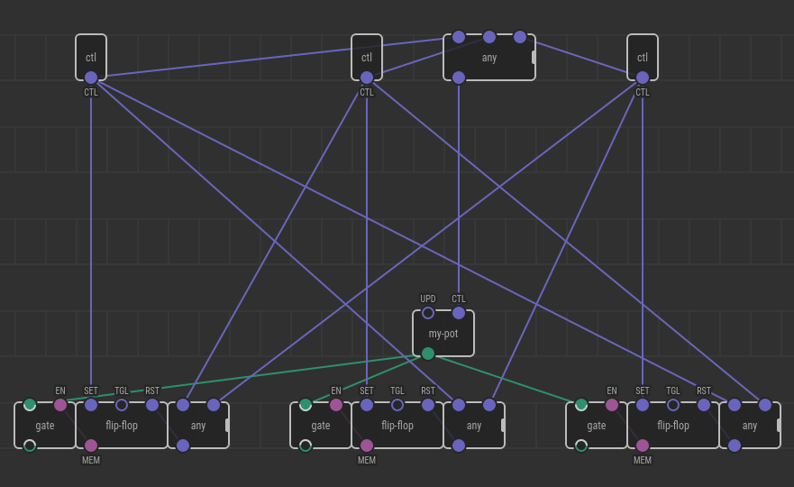

# Control Inputs and Singletons

Global variables and objects, [singletons][], and [borgs][] present in many programming languages. In general, they are considered an anti-pattern because they introduce implicit coupling between subsystems. However, there are cases when they might be the most suitable solution. For example, when there is a single physical thing such as a motor, having a singleton/borg counterpart of it in the program makes sense. Otherwise, multiple software object instances which relate to the same physical object (the motor) start to conflict. It is unknown which of the instances should be listened to. Also, several instances of the internal state can get out of sync.

Based on the experience, here are XOD scenarios where such conflicts have appeared:

1. A state machine of the traffic light where the amber light and “go-on” button should be shared across several states.
2. A sequence of actions on a servo-based mechanical arm requires joint servos sharing.
3. A four-channel motor shield is used independently by a few subsystems without channel intersections, but the motor driver board itself has a stateful shift register IC which state should be shared.

Implementing all devices listed is technically possible in XOD without any extra features, but it is tricky. A xoder should carefully control `UPD` pulses, place gates for output data, deal with `defer`’s concurrency. This is not very [Pete-friendly][pete]. What makes things worse, all that `UPD` pulses for idempotent devices (LEDs, LCDs, servos) are exposed out now even for the most trivial cases: “What the hell is `UPD` on a `led`?”

## Control input

XOD might offer a new type of input terminal. Let’s name it `input-control`. It behaves exactly like `input-pulse` but also makes the patch where it is added a kind of singleton.

All node instances of the patch having an `input-control` terminal are essentially a single node. That is, all sub-nodes used to construct the patch are not replicated once per parent instance but pasted to the final normal patch exactly once. As a consequence, all nodes of the singleton patch have a single shared internal state.

A pulse on the control pin makes the singleton receive input data from that particular node instance input pins and output the data through its pins. This effectively “cuts” all links going to and out other instances until one of them steal control for itself.

## User story

Imagine a servo-based manipulator which has two modes: manual and automatic. In the manual mode joysticks control the position whereas in the automatic mode the arm does something on its own. Consider, two patches to achieve both modes are created and working when applied individually. Now we want to make mode selection with a button.

Having both patches active in the program will introduce a conflict where the same joint servos are tried to be controlled by the two modes at the same time. A little refactoring is required.

The xoder creates two new patches: `shoulder-servo` and `forearm-servo`. For each of them he does:

- place an `input-control` terminal node and labels it `CTL`
- place a `servo` node with `PORT` bound to a hardware port number used to drive the corresponding servo
- provide access to the `servo`’s `VAL` input through another input terminal `VAL`

Now the xoder can tweak the original mode patches by replacing the original plain `servo` nodes with the newly created `shoulder-servo` and `forearm-servo`. Both nodes no longer require `PORT` setup as it already properly set. They have the same `VAL` pin, and they provide an extra `CTL` pin.

The `CTL` pin should be fed with input pulses coming from a mode switcher: the button in our case. When linked properly, only the servo nodes which got the latest control pulse (i.e., the current mode) will react to `VAL` changes. That’s precisely what we need.

## Graph normalization

Because multiple nodes in different patches should be essentially the same C++ node or a subgraph in the normalized patch, a new stage for handling singletons has to be introduced.

While flattening any singleton nodes should be considered leaf nodes, that is they stop the recursion. Then, on the flat patch, all singleton nodes which refer the same patch path should be processed in groups.

For each group containing 2 or more nodes the following steps are performed:

1. A new node of the same patch path is created (a controlee node)
2. For each input pin on the controlee, a demultiplexer node (see below) is created, and all incoming links and bound values of the nodes in the group are moved to the demultiplexer
3. For each output pin on the controlee, a multiplexor node cluster (see below) is created, and all outgoing links of the nodes in the group are moved to the multiplexor
4. The original nodes in the group are removed

When all groups are processed, the graph should be flattened again to process the controlee nodes further. Flattening repeats in a cycle until no singleton nodes left.

## Demultiplexing inputs

Imagine we have a singleton node with three instances: A, B, and C. The node has an input `IN` of type `number`. Two of the instances (A and B) have incoming links, and the third one (C) has the value of 42 bound. Here is how a demultiplexer for the `IN` pin of the controlee looks like.

It is a `xod/core/select` node with the arity level of two (i.e., three-positional select in the final turn) which has:

- `X1` with the link moved from A’s `IN`,
- `X2` with the link from B,
- `X3` bound to 42, the same value as for C.

Next:

- `S1` has a link moved from the `CTL` control input of A,
- `S2` from B,
- `S3` from C.

A shortcut for demultiplexing the control input itself may be applied. Instead of using the `select` node ahead of it a simple `any` is enough.

## Multiplexing outputs

Consider we have a singleton node with three instances: A, B, and C. The node has an output `OUT` of type `number`. Two of the instances (A and B) have outgoing links, and the third one (C) has the output floating. Here is how a multiplexer for the `OUT` pin of the controlee looks like.

Three copies of `flip-flop`+`gate` pairs with each gate having its input linked to the `OUT` pin of the controlee. Next:

- `CTL` of A is moved to `SET` of the first flip-flop,
- `CTL` of B — to the second,
- `CTL` of C — to the third.

Then an incoming `CTL` link of every original node is replicated on `RST` of all flip-flops except the one which corresponds to own `flip-flop`. That is:

- `CTL` of A is copied to `RST` of the 2-nd and 3-rd flip-flops;
- `CTL` of B is copied to the 1-st and 3-rd flip-flops;
- `CTL` of C is copied to the 1-st and 2-nd flip-flops.

Until XOD supports multiple incoming links of the pulse type to a single pin, an explicit `any` before `RST` is required.

## Consequences

All quick start hardware nodes which represent idempotent updates (such as `led`, `servo`, LCD-displays) will lose their `UPD` pins. This will make their usage more straightforward. However, it will result in dead links for existing projects using these nodes.

Perhaps, it is a good moment to extract things like `servo` and LCD-displays out of the `common-hardware` pile. This will allow leaving the old-style nodes in-place but in the deprecated state.

It will not solve all problems though as things like `led` shall be kept under `common-hardware` (?). A possible yet clunky way is leaving the `UPD` pin on such nodes and declaring (in docs) it as a no-op deprecated feature for some time.

Removing the `UPD` pins also raises a question about the `OK` and `ERR` pulses. They no longer match input semantics. A possible pattern is replacing the `OK`/`ERR` pair in such cases with a single boolean `ERR` which goes high on entering an error condition.

## TODO

Terminology: control, singleton — basically relate to the same. Can be simplified?

Can the migration be smoother for the existing users?

[singletons]: https://en.wikipedia.org/wiki/Singleton_pattern
[borgs]: https://github.com/faif/python-patterns/blob/master/creational/borg.py
[pete]: https://github.com/xodio/xod/wiki/Pete
