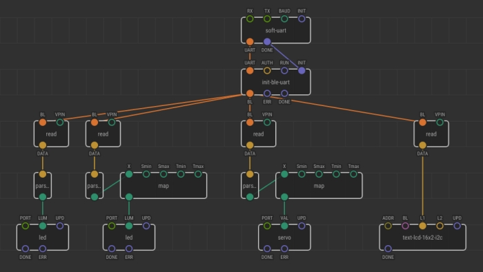

# XEN-L007: Blynk library

Let's create a `blynk` library to pair XOD and Blynk software.

This library should allow a user to operate the Arduino program written in the XOD environment by the Blynk mobile application.  

Let it be `xod/blynk`.



## Internal Representation

The main feature of the XOD and Blynk communication is the _virtual_ pin concept.
A user creates a new Blynk application and defines _virtual_ pin numbers for the widgets he has.
Each virtual pin has a corresponding value depending on the widget.

When the widget value changes, this function pushes the virtual pin number and the changed value on this pin into the global variables. 

```cpp
{{#global}}
BLYNK_WRITE_DEFAULT() {
   xodBlynkBle::blynkPin = request.pin;
   strcpy(xodBlynkBle::blynkPinData,param.asString());
}
{{/global}}
```
Arduino and Blynk can communicate via differerent protocols. If the virtual pin variables are stored in global, let's specify a namespace for each protocol. For example, the namespace for the "Arduino + BLE"  combination is `xodBlynkBle`. 

```cpp
{{#global}}
namespace xodBlynkBle {
uint8_t blynkPin;
char blynkPinData[16];
}
{{/global}}
```

XOD custom type to store virtual pins and virtual pins values.

```cpp
struct Type {
    uint8_t vpin;
    char* vpindata;
};

Type obj = { xodBlynkBle::blynkPin, xodBlynkBle::blynkPinData };
```

## Nodes

### init-ble-uart

Connects with the application. Constructs a `blynk` value for the BLE modules HM10/HC08 which communicate with Arduino via Hardware or software UART

- [in] UART :: uart — An UART object, that connected with BLE device
- [in] AUTH :: XString — Authentification key
- [in] RUN :: Pulse = Continuously — Triggers an application synchronization
- [in] INIT :: Pulse = On boot — Triggers a new connection to the application

- [out] BL :: blynk 
- [out] ERR :: Pulse — fires on a fail connection
- [out] DONE :: Pulse — fires on a successful connection

### read

Reads a virtual pin value from a Blynk application

- [in] BL :: blynk
- [in] VPIN :: Number = 0 — a number of a virual pin to read from

- [out] DATA :: XString

`XString` is used cause the virtual pin values are of the `char*` type by default in a Blynk code. Besides `XString` allows widgets that output string values.
 
### write 

Writes a value to a virtual pin of a Blynk application
  
- [in] BL :: blynk
- [in] VPIN :: Number = 0 — a number of a virual pin to write
- [in] DATA :: Number — a value to write
- [in] W :: Pulse — triggers a new write

???
However, in an Arduino Blynk examples, only a `Number` type values are sent to the application.  


TODO

### init-esp8266-uart
### init-esp8266-standalone
### init-w5500

hardware uart check


